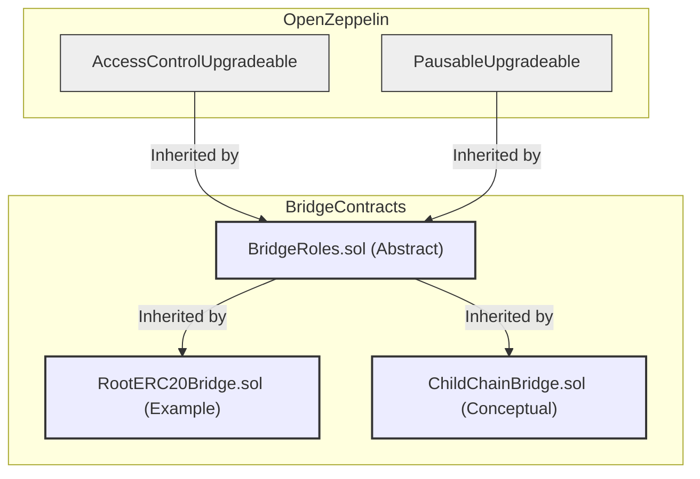

## Smart Contract Breakdown: `BridgeRoles.sol`

**Source:** `src/common/BridgeRoles.sol`

### Purpose and Function

`BridgeRoles.sol` is an abstract contract designed to provide a standardized access control and pausable functionality layer for both root and child chain bridge contracts within the Immutable zkEVM ecosystem. Its primary purpose is to ensure that sensitive operations on the bridge can only be performed by authorized entities and to offer a mechanism to halt operations in critical situations.

The contract achieves this by:

1.  **Inheriting OpenZeppelin Contracts:** It leverages the battle-tested `AccessControlUpgradeable.sol` for role-based permissions and `PausableUpgradeable.sol` for pause/unpause functionality. The "Upgradeable" suffix indicates that these are designed for use in upgradeable smart contract patterns, common in proxy-based architectures.
2.  **Defining Specific Roles:** It establishes a set of roles with distinct responsibilities crucial for bridge management.
3.  **Providing Role Management Functions:** It includes external functions to grant and revoke these roles, restricted to administrators.
4.  **Exposing Pause/Unpause Functions:** It allows authorized roles to pause and unpause the contract's functionality.

Being an `abstract contract`, `BridgeRoles.sol` is not deployed directly. Instead, other bridge contracts (like `RootERC20Bridge.sol` and its conceptual child chain counterpart) are intended to inherit from it to incorporate these access control and safety features.

### Roles and Permissions

The contract defines the following key roles:

1.  **`DEFAULT_ADMIN_ROLE`**:
    *   **Permissions:** This role is the highest administrative authority. It has the exclusive right to grant and revoke any of the other roles (`PAUSER_ROLE`, `UNPAUSER_ROLE`, `ADAPTOR_MANAGER_ROLE`).
    *   **Management:** The `grantPauserRole`, `grantUnpauserRole`, `grantAdaptorManagerRole`, `revokePauserRole`, `revokeUnpauserRole`, and `revokeAdaptorManagerRole` functions are all modified with `onlyRole(DEFAULT_ADMIN_ROLE)`, restricting their execution to holders of this role.
    *   **Origin:** This role is inherited from OpenZeppelin's `AccessControlUpgradeable`.

2.  **`PAUSER_ROLE`**:
    *   **Identifier:** `keccak256("PAUSER")`
    *   **Permissions:** Accounts holding this role are authorized to pause the contract. This is achieved by calling the `pause()` function, which in turn calls the internal `_pause()` function from `PausableUpgradeable`.
    *   **Purpose:** This role is critical for emergency situations, allowing a trusted entity to temporarily halt bridge operations to prevent loss of funds or mitigate exploits.

3.  **`UNPAUSER_ROLE`**:
    *   **Identifier:** `keccak256("UNPAUSER")`
    *   **Permissions:** Accounts holding this role are authorized to unpause the contract. This is done by calling the `unpause()` function, which executes the internal `_unpause()` function from `PausableUpgradeable`.
    *   **Purpose:** This role allows for the resumption of normal bridge operations after a pause, once the underlying issue has been addressed.

4.  **`ADAPTOR_MANAGER_ROLE`**:
    *   **Identifier:** `keccak256("ADAPTOR_MANAGER")`
    *   **Permissions:** While `BridgeRoles.sol` itself doesn't show functions explicitly restricted by `ADAPTOR_MANAGER_ROLE`, this role is defined for use in contracts that inherit `BridgeRoles.sol`. Its purpose is to manage the configuration or address of the bridge adaptor (as seen in the `IRootBridgeAdaptor.sol` context). For instance, a function like `updateBridgeAdaptor(address newAdaptor)` in an inheriting contract would typically be restricted to this role.
    *   **Purpose:** This role allows designated accounts to manage the critical message passing component of the bridge, ensuring that it points to the correct and secure adaptor contract.

### Inheritance Diagram

The following Mermaid diagram illustrates how `BridgeRoles.sol` is intended to be used as a base contract for other bridge-specific contracts:

This diagram shows that `BridgeRoles.sol` itself inherits from OpenZeppelin's `AccessControlUpgradeable` and `PausableUpgradeable`. Then, specific bridge implementations like a `RootERC20Bridge` or a conceptual `ChildChainBridge` would inherit from `BridgeRoles.sol` to gain its access control and pausable features. This promotes code reuse and a consistent security model across different parts of the bridge infrastructure.
---

This breakdown provides a comprehensive overview of the `BridgeRoles.sol` contract, its functionalities, and its role within the larger bridge architecture.
