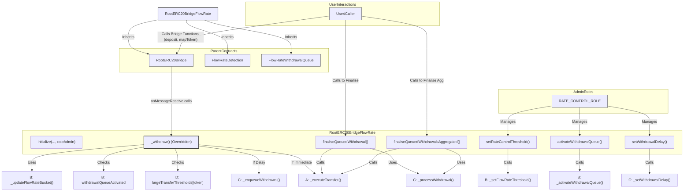

## Smart Contract Breakdown: `RootERC20BridgeFlowRate.sol`

**Source:** `src/root/flowrate/RootERC20BridgeFlowRate.sol`
**Interface:** `src/interfaces/root/flowrate/IRootERC20BridgeFlowRate.sol`

### Purpose and Function

`RootERC20BridgeFlowRate.sol` is a smart contract that extends the functionality of `RootERC20Bridge.sol` by incorporating advanced security features designed to mitigate risks associated with large and rapid token outflows. It achieves this by inheriting from and integrating `FlowRateDetection.sol` (for monitoring token withdrawal rates using a bucket system) and `FlowRateWithdrawalQueue.sol` (for managing a queue of withdrawals that are delayed due to security triggers).

The primary purpose of this contract is to provide a more robust and secure root chain bridge that can:

1.  Detect and react to unusually high withdrawal volumes for specific tokens.
2.  Delay individual large withdrawals that exceed a predefined threshold.
3.  Delay withdrawals of tokens for which flow rate parameters have not yet been configured.
4.  Allow for manual activation of a global withdrawal queue in emergency situations.
5.  Enable users to process their delayed withdrawals after a configurable time period.

By combining these features, `RootERC20BridgeFlowRate.sol` aims to reduce the potential impact of exploits or sudden market movements that could otherwise drain bridge liquidity rapidly.

### Inheritance and Integration

`RootERC20BridgeFlowRate.sol` is a multi-faceted contract due to its inheritance:

*   **`RootERC20Bridge`**: Provides the foundational ERC20 bridging functionalities (mapping tokens, deposits, basic withdrawal execution logic via `_executeTransfer`).
*   **`FlowRateDetection`**: Implements the token-specific bucket system (`flowRateBuckets`, `_updateFlowRateBucket`, `_setFlowRateThreshold`) and the global `withdrawalQueueActivated` flag.
*   **`FlowRateWithdrawalQueue`**: Manages the per-user queues for delayed withdrawals (`pendingWithdrawals`, `_enqueueWithdrawal`, `_processWithdrawal`, `_setWithdrawalDelay`).

The key integration point is the overridden `_withdraw` function, which intercepts withdrawal requests, consults the `FlowRateDetection` logic, and then decides whether to execute the withdrawal immediately (via `_executeTransfer` from `RootERC20Bridge`) or to delay it by placing it into the queue (via `_enqueueWithdrawal` from `FlowRateWithdrawalQueue`).

### Roles

*   **`RATE_CONTROL_ROLE = keccak256("RATE")`**:
    *   A new role introduced by this contract.
    *   **Permissions:** Accounts with this role are responsible for managing the flow rate security parameters. This includes:
        *   Manually activating (`activateWithdrawalQueue`) or deactivating (`deactivateWithdrawalQueue`) the global withdrawal queue.
        *   Setting the `withdrawalDelay` for queued withdrawals.
        *   Configuring token-specific flow rate thresholds (`setRateControlThreshold`), which includes setting the bucket `capacity`, `refillRate` (from `FlowRateDetection`), and the `largeTransferThresholds` (specific to this contract).
    *   This role is distinct from other roles like `DEFAULT_ADMIN_ROLE` or `PAUSER_ROLE` inherited from `BridgeRoles` (via `RootERC20Bridge`).

### Key Functions (New and Overridden)

#### Initialization

*   **`constructor(address _initializerAddress)`**:
    *   Calls the `RootERC20Bridge` constructor, passing through the `_initializerAddress`.
*   **`initialize(..., address rateAdmin)` (overrides `RootERC20Bridge.initialize`)**:
    *   Takes all parameters from `RootERC20Bridge.initialize` plus an additional `rateAdmin` address.
    *   Reverts if `rateAdmin == address(0)`.
    *   Calls `__RootERC20Bridge_init(...)` to initialize the base bridge functionalities.
    *   Calls `__FlowRateWithdrawalQueue_init()` to initialize the withdrawal queue (e.g., set default delay).
    *   Grants the `RATE_CONTROL_ROLE` to the `rateAdmin` address.
*   **`initialize(InitializationRoles memory, address, address, address, address, address, uint256) external pure override`**:
    *   This is a deliberate override of the original `RootERC20Bridge.initialize` signature (without `rateAdmin`).
    *   It is marked `pure` and always reverts with `WrongInitializer()`. This ensures that the bridge cannot be initialized without setting up the `rateAdmin`, effectively forcing the use of the new initializer.

#### Manual Queue and Delay Control (exposing `FlowRateDetection` and `FlowRateWithdrawalQueue` internal functions)

*   **`activateWithdrawalQueue() external onlyRole(RATE_CONTROL_ROLE)`**:
    *   Calls `_activateWithdrawalQueue()` (from `FlowRateDetection`) to manually set `withdrawalQueueActivated = true`.
*   **`deactivateWithdrawalQueue() external onlyRole(RATE_CONTROL_ROLE)`**:
    *   Calls `_deactivateWithdrawalQueue()` (from `FlowRateDetection`) to manually set `withdrawalQueueActivated = false`.
*   **`setWithdrawalDelay(uint256 delay) external onlyRole(RATE_CONTROL_ROLE)`**:
    *   Calls `_setWithdrawalDelay(delay)` (from `FlowRateWithdrawalQueue`) to update the global `withdrawalDelay`.

#### Flow Rate Configuration

*   **`setRateControlThreshold(address token, uint256 capacity, uint256 refillRate, uint256 largeTransferThreshold) external onlyRole(RATE_CONTROL_ROLE)`**:
    *   Allows the `RATE_CONTROL_ROLE` to configure flow rate parameters for a specific `token`.
    *   Calls `_setFlowRateThreshold(token, capacity, refillRate)` (from `FlowRateDetection`) to set the bucket's capacity and refill rate.
    *   Sets `largeTransferThresholds[token] = largeTransferThreshold`. This `largeTransferThresholds` mapping is specific to `RootERC20BridgeFlowRate` and defines a per-token value above which any single withdrawal is automatically queued.
    *   Emits `RateControlThresholdSet` with new and previous values.

#### Withdrawal Logic (Overridden)

*   **`_withdraw(bytes memory data) internal override`**:
    *   This function is the core of the flow rate control integration, overriding the simpler `_withdraw` from `RootERC20Bridge`.
    *   **1. Decode:** Calls `_decodeAndValidateWithdrawal(data)` (from `RootERC20Bridge`) to get withdrawal details (`rootToken`, `childToken`, `withdrawer`, `receiver`, `amount`).
    *   **2. Update Bucket & Check for Unconfigured Token:**
        *   `bool delayWithdrawalUnknownToken = _updateFlowRateBucket(rootToken, amount);` (from `FlowRateDetection`). This updates the token's bucket depth. If the token has no bucket configured (`capacity == 0`), `delayWithdrawalUnknownToken` will be `true`.
    *   **3. Check Large Transfer Threshold:**
        *   `bool delayWithdrawalLargeAmount = false;`
        *   `if (!delayWithdrawalUnknownToken) { delayWithdrawalLargeAmount = (amount >= largeTransferThresholds[rootToken]); }`
        *   If the token *is* configured, this checks if the `amount` meets or exceeds the `largeTransferThresholds[rootToken]`. If so, `delayWithdrawalLargeAmount` becomes `true`.
    *   **4. Check Global Queue Activation:**
        *   `bool queueActivated = withdrawalQueueActivated;` (reads the flag from `FlowRateDetection`).
    *   **5. Decision to Enqueue or Execute:**
        *   `if (delayWithdrawalLargeAmount || delayWithdrawalUnknownToken || queueActivated)`:
            *   If any of these conditions are true (individual large transfer, unconfigured token, or globally activated queue), the withdrawal is enqueued.
            *   Calls `_enqueueWithdrawal(receiver, withdrawer, rootToken, amount)` (from `FlowRateWithdrawalQueue`).
            *   Emits `QueuedWithdrawal` event detailing the reasons for queuing.
        *   `else`:
            *   If none of the delay conditions are met, the withdrawal is executed immediately.
            *   Calls `_executeTransfer(rootToken, childToken, withdrawer, receiver, amount)` (from `RootERC20Bridge`) to transfer the tokens.

#### Processing Queued Withdrawals

*   **`finaliseQueuedWithdrawal(address receiver, uint256 index) external nonReentrant`**:
    *   Allows a user (`receiver`) to process a single withdrawal from their queue that has met its `withdrawalDelay`.
    *   Calls `_processWithdrawal(receiver, index)` (from `FlowRateWithdrawalQueue`) to validate the withdrawal and get its details.
    *   Retrieves `childToken` using `rootTokenToChildToken[token]`.
    *   Calls `_executeTransfer(token, childToken, withdrawer, receiver, amount)` (from `RootERC20Bridge`) to release the funds.
*   **`finaliseQueuedWithdrawalsAggregated(address receiver, address token, uint256[] calldata indices) external nonReentrant`**:
    *   Allows a user to process multiple queued withdrawals for the *same token* in an aggregated manner. This can save gas compared to multiple individual `finaliseQueuedWithdrawal` calls.
    *   Reverts if `indices.length == 0` (`ProvideAtLeastOneIndex`).
    *   Iterates through the provided `indices`:
        *   For each `index`, calls `_processWithdrawal(receiver, indices[i])`.
        *   Validates that `actualToken` from `_processWithdrawal` matches the input `token` (reverts with `MixedTokens` if not).
        *   Accumulates the `amount` into `total`.
    *   Retrieves `childToken` using `rootTokenToChildToken[token]`.
    *   Calls `_executeTransfer(token, childToken, withdrawer, receiver, total)` once with the aggregated `total`. The `withdrawer` in the emitted event will be that of the last processed index.

### Event Emissions (from `IRootERC20BridgeFlowRateEvents`)

*   `RateControlThresholdSet(...)`: Emitted when `setRateControlThreshold` is called.
*   `QueuedWithdrawal(...)`: Emitted by `_withdraw` when a withdrawal is enqueued, indicating the reasons.
*   Inherits events from `RootERC20BridgeEvents`, `IFlowRateWithdrawalQueueEvents`, and `FlowRateDetection` (though `FlowRateDetection` events are typically emitted by its own internal functions called by this contract).

### Custom Errors (from `IRootERC20BridgeFlowRateErrors`)

*   `WrongInitializer()`: If the old `RootERC20Bridge.initialize` function is called.
*   `ProvideAtLeastOneIndex()`: If `finaliseQueuedWithdrawalsAggregated` is called with an empty `indices` array.
*   `MixedTokens(address token, address actualToken)`: If an index in `finaliseQueuedWithdrawalsAggregated` refers to a different token than specified.
*   Inherits errors from `IRootERC20BridgeErrors`, `IFlowRateWithdrawalQueueErrors`, and `FlowRateDetection`.

### Calculations/Logic Focus

*   **`_withdraw` Decision Logic:**
    The decision to enqueue a withdrawal is based on three boolean flags:
    1.  `delayWithdrawalUnknownToken`: True if `_updateFlowRateBucket` returns true (i.e., the token's flow rate bucket `capacity` is 0).
    2.  `delayWithdrawalLargeAmount`: True if `!delayWithdrawalUnknownToken` AND `amount >= largeTransferThresholds[rootToken]`.
    3.  `queueActivated`: True if `withdrawalQueueActivated` (the global flag from `FlowRateDetection`) is true.
    If *any* of these flags are true, the withdrawal is enqueued; otherwise, it's executed immediately.

### Potential Risks

*   **Inherited Risks:** All risks identified for `RootERC20Bridge`, `FlowRateDetection`, and `FlowRateWithdrawalQueue` apply to this contract, including:
    *   Reentrancy (mitigated by `nonReentrant` on finalization functions).
    *   Timestamp manipulation affecting bucket refills and withdrawal eligibility.
    *   Misconfiguration of `withdrawalDelay` (can be very long).
    *   Gas limit issues with very large user queues (mostly for off-chain consumers).
    *   Bridging non-standard ERC20s.
*   **Misconfiguration of `RATE_CONTROL_ROLE`**: If this role is compromised or assigned incorrectly, malicious actors could:
    *   Disable the withdrawal queue (`deactivateWithdrawalQueue`).
    *   Set `withdrawalDelay` to zero.
    *   Set overly permissive `largeTransferThresholds` or bucket parameters (`capacity`, `refillRate`), effectively disabling the flow rate protection.
    *   Conversely, they could set overly restrictive parameters to disrupt normal bridge operations.
*   **Griefing Attacks (Front-running Withdrawals)**:
    *   As noted in the contract comments: "An attacker could observe pending withdrawals, and grief a legitimate user's withdrawal. They could do this by withdrawing a sum, which when combined with the users, is just about the flow rate that will trigger the withdrawal queue, immediately before the legitimate user. The legitimate user's withdrawal would then trigger the withdrawal queue."
    *   Mitigation involves setting bucket parameters (`capacity`, `refillRate`) high enough that such an attack would be economically infeasible or require substantial capital from the attacker. This requires careful monitoring and adjustment of parameters based on typical bridge flows.
*   **Complexity**: The interaction of three distinct inherited functionalities (`RootERC20Bridge`, `FlowRateDetection`, `FlowRateWithdrawalQueue`) increases the overall complexity of the contract. While this allows for modularity, it also means that understanding the exact state and behavior requires considering the interplay of all parent contracts. Careful auditing and testing are crucial.
*   **Centralization Risk with `RATE_CONTROL_ROLE`**: The ability of the `RATE_CONTROL_ROLE` to significantly alter the security posture of the bridge (e.g., by changing delays or thresholds) introduces a degree of centralization. Secure management of this role is paramount.

### Mermaid Diagram: Inheritance and Key Interactions

This diagram shows `RootERC20BridgeFlowRate` inheriting from its three parent contracts. Key interactions involve its overridden `_withdraw` function calling methods from `FlowRateDetection` and potentially `FlowRateWithdrawalQueue` or `RootERC20Bridge` based on the outcome of security checks. User finalization functions also call methods from `FlowRateWithdrawalQueue` and `RootERC20Bridge`. The `RATE_CONTROL_ROLE` interacts with functions in `RootERC20BridgeFlowRate` that in turn call configuration functions in the parent contracts.
