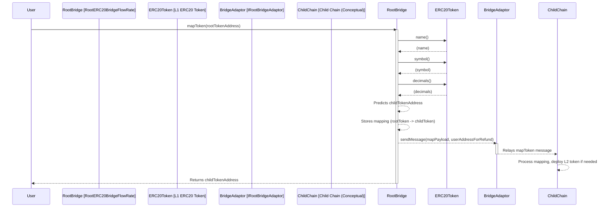
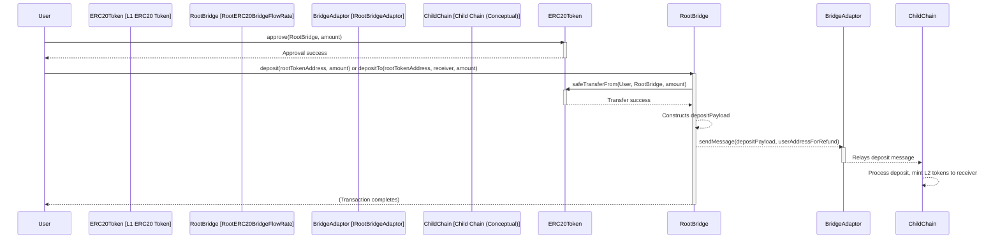
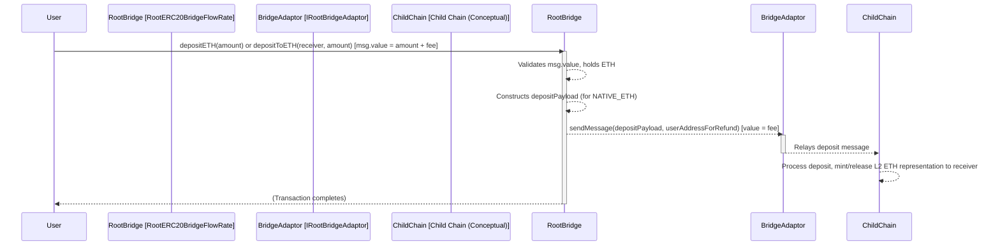
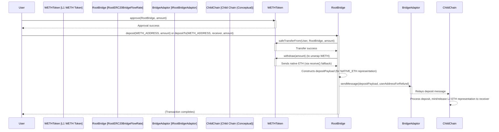
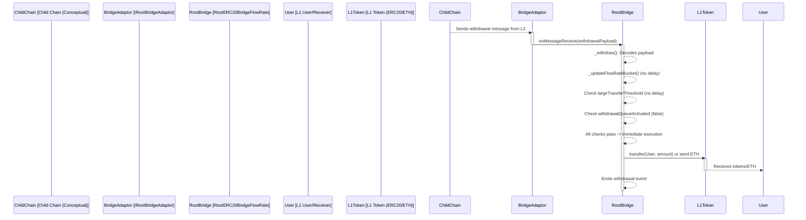
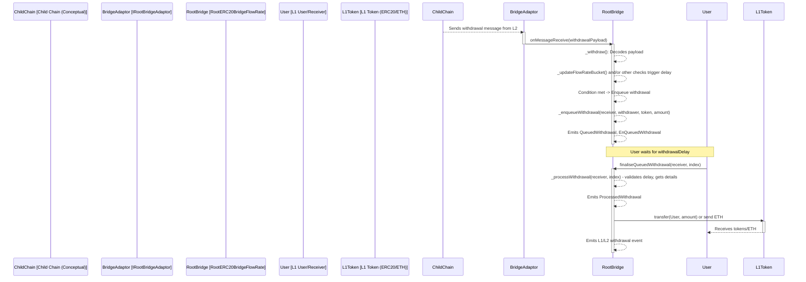

## User Flow Analysis

This section describes common user interactions with the Immutable zkEVM bridge, specifically focusing on the `RootERC20BridgeFlowRate` contract and its interactions with underlying components like `IRootBridgeAdaptor`. Diagrams are provided using Mermaid syntax to illustrate these flows.

---

### 1. Token Mapping

Before an ERC20 token (that isn't pre-mapped like ETH/WETH/IMX) can be bridged, it must be "mapped." This process registers the L1 token with the bridge and allows the bridge to predict/establish its corresponding L2 token address.

**Steps:**

1.  **User Initiates:** A user (or an automated system) calls the `mapToken(IERC20Metadata rootToken)` function on the `RootERC20BridgeFlowRate` contract.
2.  **Contract Logic (`RootERC20Bridge`):**
    *   Checks if the token is eligible for mapping (not already mapped, not native ETH/WETH/IMX).
    *   Predicts the child token address using `Clones.predictDeterministicAddress`.
    *   Stores the mapping `rootTokenToChildToken` locally.
    *   Retrieves token metadata (name, symbol, decimals).
    *   Constructs a `MAP_TOKEN_SIG` payload.
3.  **Message Passing:** The bridge calls `IRootBridgeAdaptor.sendMessage()` with the payload and any required fee (from `msg.value` of the `mapToken` call).
4.  **L2 Action (Conceptual):** The message is relayed to the child chain, where the child bridge contract processes it, typically deploying a new child token contract if it doesn't exist or simply acknowledging the mapping.

**Diagram:**

---

### 2. ERC20 Token Deposit

This flow describes a user depositing a standard (mapped) ERC20 token from L1 to L2.

**Steps:**

1.  **User Approval (Pre-requisite):** User approves the `RootERC20BridgeFlowRate` contract to spend their ERC20 tokens via the token's `approve()` method.
2.  **User Initiates Deposit:** User calls `deposit(IERC20Metadata rootToken, uint256 amount)` or `depositTo(IERC20Metadata rootToken, address receiver, uint256 amount)` on the `RootERC20BridgeFlowRate`.
3.  **Contract Logic (`RootERC20Bridge`):**
    *   Validates inputs (token mapped, amount > 0, etc.).
    *   Transfers the ERC20 tokens from the user to the bridge contract using `safeTransferFrom`.
    *   Constructs a `DEPOSIT_SIG` payload containing token address, depositor, receiver, and amount.
4.  **Message Passing:** The bridge calls `IRootBridgeAdaptor.sendMessage()` with the payload and any required fee (from `msg.value`).
5.  **L2 Action (Conceptual):** The message is relayed to the child chain, where the child bridge contract processes it, typically minting the corresponding amount of the L2 token to the specified receiver.

**Diagram:**

---

### 3. Native ETH Deposit

This flow describes a user depositing native ETH from L1 to L2.

**Steps:**

1.  **User Initiates Deposit:** User calls `depositETH(uint256 amount)` or `depositToETH(address receiver, uint256 amount)` on the `RootERC20BridgeFlowRate`, sending native ETH along with the transaction (`msg.value` must cover the `amount` plus any bridge fee).
2.  **Contract Logic (`RootERC20Bridge`):**
    *   Validates inputs (`msg.value >= amount`).
    *   The contract now holds the native ETH.
    *   Constructs a `DEPOSIT_SIG` payload, using a special address for native ETH (`0xeee`), depositor, receiver, and amount.
3.  **Message Passing:** The bridge calls `IRootBridgeAdaptor.sendMessage()` with the payload and the fee (calculated as `msg.value - amount`).
4.  **L2 Action (Conceptual):** The message is relayed to the child chain. The child bridge processes it, minting/releasing the corresponding amount of its native ETH representation (e.g., wrapped ETH on L2, or L2 native IMX if ETH is bridged as IMX) to the specified receiver.

**Diagram:**

---

### 4. WETH Deposit

This flow describes a user depositing Wrapped ETH (WETH) from L1, which is typically converted to the native ETH representation on L2.

**Steps:**

1.  **User Approval (Pre-requisite):** User approves the `RootERC20BridgeFlowRate` contract to spend their WETH tokens.
2.  **User Initiates Deposit:** User calls `deposit(IWETH_ADDRESS, amount)` or `depositTo(IWETH_ADDRESS, receiver, amount)`.
3.  **Contract Logic (`RootERC20Bridge`):**
    *   Validates inputs.
    *   Transfers the WETH tokens from the user to the bridge contract using `safeTransferFrom`.
    *   Calls `IWETH(WETH_ADDRESS).withdraw(amount)` on the WETH contract. This unwraps the WETH into native ETH, which is sent to the bridge contract (and received by its `receive()` fallback function).
    *   The bridge now holds native ETH.
    *   Constructs a `DEPOSIT_SIG` payload, using the special address for native ETH (`0xeee` or similar, as WETH on L1 becomes native ETH on L2), depositor, receiver, and amount.
4.  **Message Passing:** The bridge calls `IRootBridgeAdaptor.sendMessage()` with the payload and any required fee (from `msg.value`).
5.  **L2 Action (Conceptual):** Similar to an ETH deposit, the child bridge processes the message to mint/release the L2 ETH representation.

**Diagram:**

---

### 5. Withdrawal (Normal Path - No Flow Rate Trigger)

This flow describes a user withdrawing assets from L2 back to L1, where no flow rate limits are triggered.

**Steps:**

1.  **User Initiates on L2 (Conceptual):** User initiates a withdrawal on the child chain. This action sends a message from L2 to L1.
2.  **Message Reception (L1):** The `IRootBridgeAdaptor` on L1 receives the message from the child chain and calls `onMessageReceive(bytes calldata data)` on the `RootERC20BridgeFlowRate` contract.
3.  **Contract Logic (`RootERC20BridgeFlowRate._withdraw`):**
    *   Decodes the `data` payload to get withdrawal details (token, receiver, amount, etc.).
    *   Calls `_updateFlowRateBucket` (from `FlowRateDetection`). This updates the token's bucket. For this normal path, it's assumed `delayWithdrawalUnknownToken` is `false`.
    *   Checks `amount` against `largeTransferThresholds[rootToken]`. For this path, `delayWithdrawalLargeAmount` is `false`.
    *   Checks `withdrawalQueueActivated` (global flag). For this path, it's `false`.
    *   Since all delay conditions are false, the contract proceeds to immediate execution.
4.  **Token Transfer (`RootERC20Bridge._executeTransfer`):**
    *   Transfers the specified `rootToken` (or native ETH) from the bridge's holdings to the `receiver`.
    *   Emits relevant withdrawal events.

**Diagram:**

---

### 6. Withdrawal (Flow Rate Triggered - Queued Path)

This flow describes a withdrawal that is delayed and queued due to flow rate limits or other security triggers.

**Steps:**

1.  **User Initiates on L2 (Conceptual):** Similar to the normal withdrawal.
2.  **Message Reception (L1):** `IRootBridgeAdaptor` calls `onMessageReceive()` on `RootERC20BridgeFlowRate`.
3.  **Contract Logic (`RootERC20BridgeFlowRate._withdraw`):**
    *   Decodes payload.
    *   Calls `_updateFlowRateBucket`. One or more conditions become true:
        *   `delayWithdrawalUnknownToken` is `true` (token not configured for flow rate).
        *   OR `delayWithdrawalLargeAmount` is `true` (withdrawal exceeds individual large transfer threshold).
        *   OR `withdrawalQueueActivated` is `true` (global queue manually or automatically activated).
    *   Because a delay condition is met, the withdrawal is enqueued.
4.  **Enqueueing (`FlowRateWithdrawalQueue._enqueueWithdrawal`):**
    *   The withdrawal details (receiver, withdrawer, token, amount, current timestamp) are added to the `pendingWithdrawals[receiver]` array.
    *   `QueuedWithdrawal` and `EnQueuedWithdrawal` events are emitted.
5.  **Waiting Period:** The user must wait for the `withdrawalDelay` period.
6.  **User Finalizes Withdrawal:**
    *   After the delay, the user calls `finaliseQueuedWithdrawal(receiverAddress, index)` or `finaliseQueuedWithdrawalsAggregated(receiverAddress, tokenAddress, indices[])` on `RootERC20BridgeFlowRate`.
7.  **Processing Queued Item (`FlowRateWithdrawalQueue._processWithdrawal`):**
    *   Validates the index and checks if `block.timestamp >= (queuedTimestamp + withdrawalDelay)`.
    *   Retrieves withdrawal details and marks the queue item as processed (deletes it).
8.  **Token Transfer (`RootERC20Bridge._executeTransfer`):**
    *   The `RootERC20BridgeFlowRate` contract then calls `_executeTransfer` to release the funds to the user.

**Diagram:**

These flows provide a high-level understanding of how users interact with the bridge for common operations and how the security features (flow rate detection and withdrawal queue) integrate into these processes.
---
